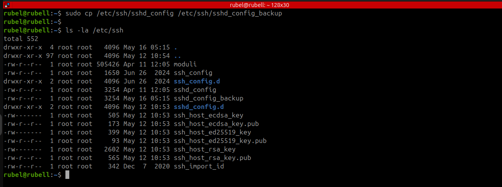
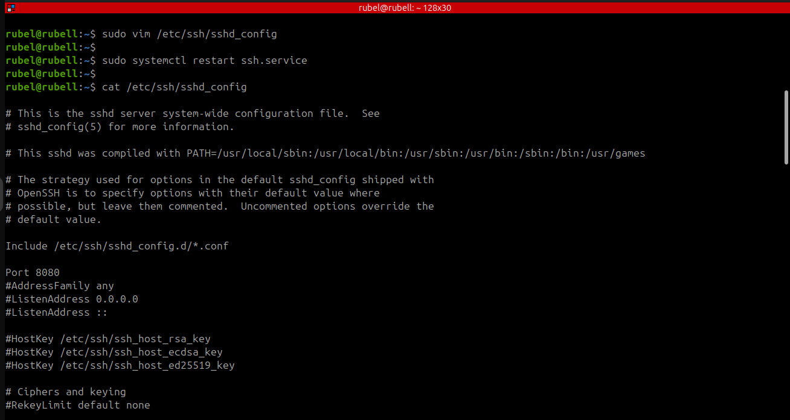
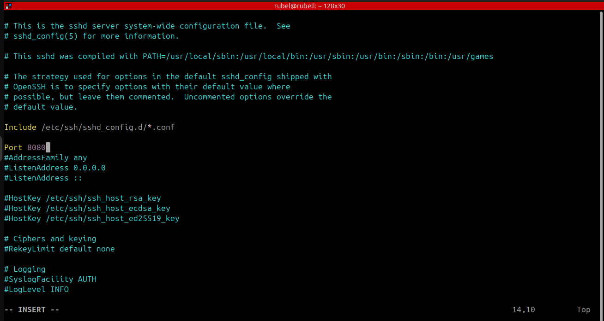
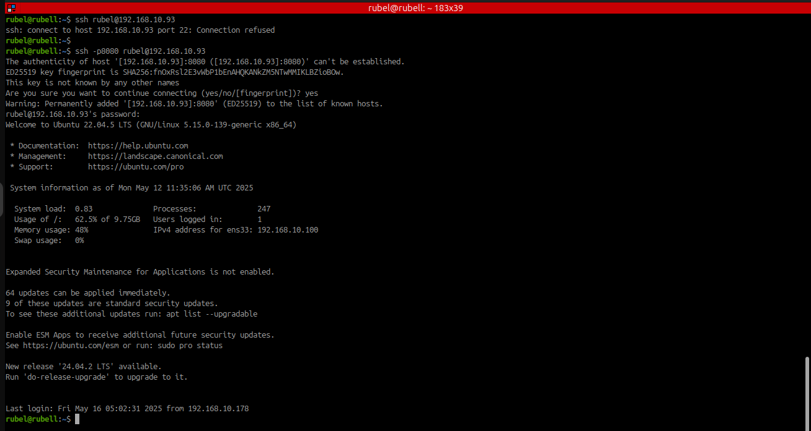

# 🚀 SSH Installation and Configuration on Ubuntu 22.04

This guide explains how to install, configure, and use SSH (Secure Shell) on Ubuntu 22.04 securely and effectively.

---

## 📋 Table of Contents

1. [🔐 What is SSH?](#-what-is-ssh)
2. [🏗️ SSH Architecture](#-ssh-architecture)
3. [🛠️ Step 1: Install SSH Server](#-step-1-install-ssh-server)
4. [▶️ Step 2: Start and Enable SSH Service](#-step-2-start-and-enable-ssh-service)
5. [⚙️ Step 3: Configure Custom SSH Port](#-step-3-configure-custom-ssh-port)
6. [🧱 Step 4: Allow SSH through the Firewall](#-step-4-allow-ssh-through-the-firewall)
7. [🌐 Step 5: Connect from a Remote System](#-step-5-connect-from-a-remote-system)
8. [🔄 Step 6: Manage SSH Service](#-step-6-manage-ssh-service)
9. [🔐 SSH Hardening Tips](#-ssh-hardening-tips)

---

## 🔐 What is SSH?

SSH (Secure Shell) is a network protocol used for securely accessing remote machines over an encrypted connection. It is widely used in UNIX-like systems to manage servers and execute remote commands safely.

---

## 🏗️ SSH Architecture

SSH relies on public-key cryptography and operates in three main layers:

- **Transport Layer:** Establishes encrypted communication and verifies the server.
- **Authentication Layer:** Verifies the client using passwords or SSH keys.
- **Connection Layer:** Manages channels for command execution or file transfer.

---

## 🛠️ Step 1: Install SSH Server

Run the following commands to update the system and install the OpenSSH server.

```bash
sudo apt update
sudo apt install openssh-server
```

---

## ▶️ Step 2: Start and Enable SSH Service

Check the status and ensure SSH starts on boot:

```bash
sudo systemctl status ssh
sudo systemctl enable --now ssh
```

---

## ⚙️ Step 3: Configure Custom SSH Port

By default, SSH listens on port 22. Changing this helps prevent automated attacks.

### Backup Configuration

```bash
sudo cp /etc/ssh/sshd_config /etc/ssh/sshd_config_backup
```


### Edit Config File

```bash
sudo vim /etc/ssh/sshd_config
```

### Change or add the following lines:

```conf
Port 8080
PermitRootLogin no
PermitEmptyPasswords no
Protocol 2
ClientAliveInterval 300
AllowUsers your_username
```

### Restart SSH for changes to take effect:

```bash
sudo systemctl restart ssh
```


 - Port Change Value



---

## 🧱 Step 4: Allow SSH through the Firewall

If UFW is active, allow the new port through it:

```bash
sudo ufw allow from any to any port 8080 proto tcp
```

Check UFW status with:

```bash
sudo ufw status
```

---

## 🌐 Step 5: Connect from a Remote System

Make sure `openssh-client` is installed on the client machine:

```bash
sudo apt install openssh-client
```

Connect using SSH:

```bash
ssh your_username@remote_ip_address
# Or with custom port
ssh your_username@remote_ip_address -p 8080
```

Example:

```bash
ssh rubel@192.168.10.93 -p 8080
```


---

## 🔄 Step 6: Manage SSH Service

Use `systemctl` to manage SSH:

```bash
sudo systemctl status ssh     # Check status
sudo systemctl stop ssh       # Stop service
sudo systemctl start ssh      # Start service
sudo systemctl enable ssh     # Enable on boot
sudo systemctl disable ssh    # Disable on boot
```

---

## 🔐 SSH Hardening Tips

To improve SSH security:

- Use SSH key authentication instead of passwords.
- Disable root login via SSH.
- Change default SSH port (already done above).
- Use fail2ban or similar tools to block brute-force attacks.
- Allow access only to specific users using `AllowUsers`.

---

✅ **Now your Ubuntu system is ready for secure remote access via SSH!**

For any troubleshooting, check the logs:

```bash
journalctl -xe | grep ssh
```
