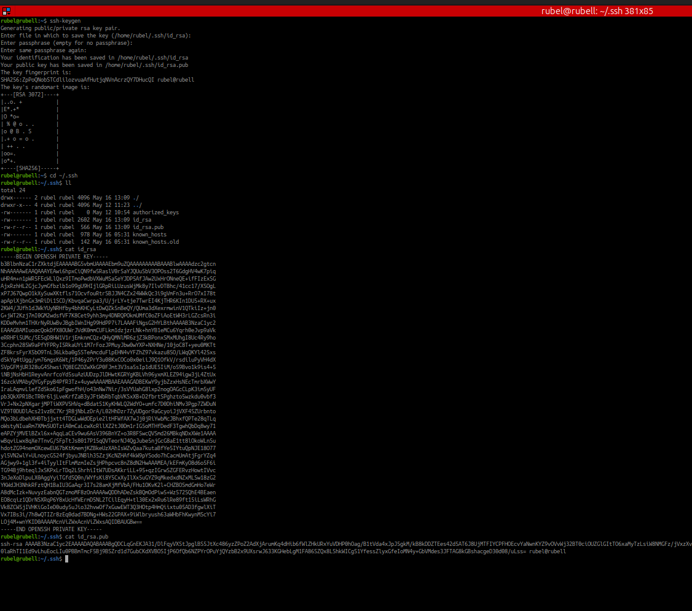
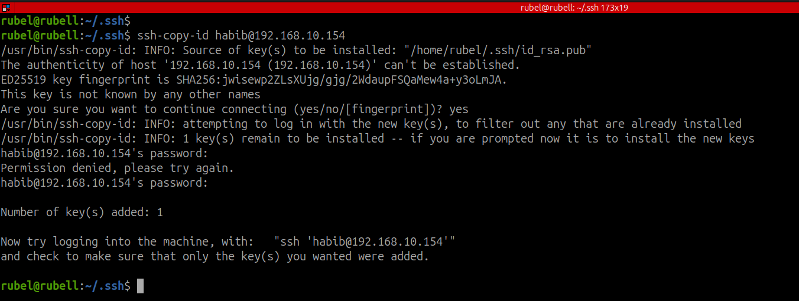
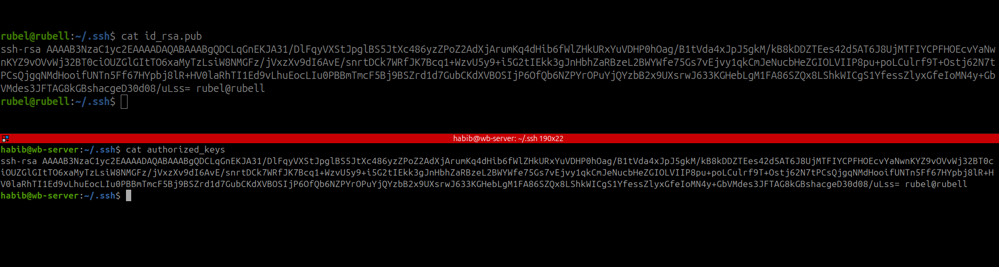
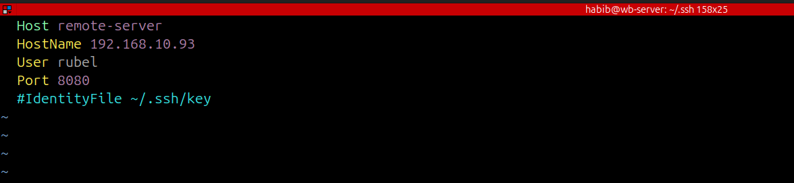
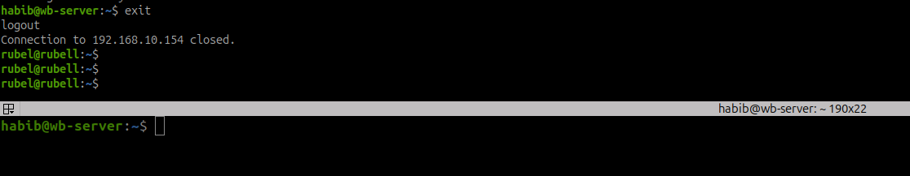

# 🔐 SSH Key-Based Authentication & Custom SSH Config Guide

This guide explains how to securely log in to a remote server using SSH key-based authentication and how to simplify connections with a custom SSH configuration file.

---

## 📚 Table of Contents

- [What is SSH Key-Based Authentication?](#what-is-ssh-key-based-authentication)
- [Benefits](#benefits)
- [Best Practices](#best-practices)
- [Step-by-Step Guide](#step-by-step-guide)
  - [1. Generate SSH Key Pair](#1-generate-ssh-key-pair)
  - [2. View the Keys](#2-view-the-keys)
  - [3. Copy Public Key to Remote Server](#3-copy-public-key-to-remote-server)
  - [4. Verify Key on Remote Server](#4-verify-key-on-remote-server)
  - [5. Create SSH Config File](#5-create-ssh-config-file)
  - [6. Connect Easily](#6-connect-easily)
- [Architecture Diagram](#architecture-diagram)
- [Troubleshooting](#troubleshooting)
- [Conclusion](#conclusion)


---

## What is SSH Key-Based Authentication?

Instead of typing a password each time you log in to a server, SSH allows you to authenticate using a **key pair** — a public key stored on the server and a private key on your machine.

---

## Benefits

- **More Secure** – Eliminates brute-force password attacks.
- **Faster Login** – No password prompt.
- **Script Friendly** – Automates server tasks.
- **Configurable** – Combine with `~/.ssh/config` for aliases and custom ports.

---

## Best Practices

- Keep your **private key secret**.
- Use a **passphrase** for your key.
- **Disable root login** on the server.
- Use **firewalls** and change default SSH ports.
- Use `AllowUsers` and `fail2ban` for extra security.

---

## Step-by-Step Guide

### 1. Generate SSH Key Pair

```bash
ssh-keygen -t rsa -b 2048


- Press Enter to accept the default file location: `~/.ssh/id_rsa`
- Choose a secure **passphrase** (optional but recommended)

---

### 2️⃣ View the Keys

```bash
cd ~/.ssh
ls -l
cat id_rsa        # Private key (never share this!)
cat id_rsa.pub    # Public key (can be shared)
```


---

### 3️⃣ Copy Public Key to Remote Server

```bash
ssh-copy-id username@remote_ip
# Example:
ssh-copy-id habib@192.168.10.154
```

This will append your public key to the remote file: `~/.ssh/authorized_keys`



---

### 4️⃣ Verify Key on Remote Server

On the remote server (`habib@192.168.10.154`), run:

```bash
cat ~/.ssh/authorized_keys
```

You should see your public key there. This confirms the key was copied successfully.



---

### 5️⃣ Create SSH Config File

Create or edit the SSH config file on your local machine:

```bash
cd ~/.ssh
vim config
```

Example configuration:

```ini
Host web-server
  HostName 192.168.10.93
  User rubel
  Port 8080
  IdentityFile ~/.ssh/id_rsa
```


This lets you connect using a simple alias instead of full IP and port.

---

### 6️⃣ Connect Easily

```bash
ssh web-server
```

This will connect as user `rubel` to IP `192.168.10.93` using port `8080`, without needing to type the full command.



---

## 🧭 Architecture Diagram

```
+--------------------------+                       +----------------------------+
|      Local Machine       |  SSH Public Key Auth  |        Remote Server       |
|--------------------------|---------------------->|----------------------------|
| ~/.ssh/id_rsa (private)  |  ⬅️ Used to decrypt   | ~/.ssh/authorized_keys     |
| ~/.ssh/config (optional) |     the challenge     | stores public key          |
+--------------------------+                       +----------------------------+
```

---

## 🛠️ Troubleshooting

- 🔍 **Check SSH logs on server**:  
  ```bash
  journalctl -xe | grep ssh
  ```

- 🔐 **Permission errors**:  
  Make sure `.ssh` folder and files have correct permissions:

  ```bash
  chmod 700 ~/.ssh
  chmod 600 ~/.ssh/authorized_keys
  chmod 600 ~/.ssh/id_rsa
  chmod 644 ~/.ssh/id_rsa.pub
  ```

- 🔁 **Regenerate or reset keys** if needed:
  ```bash
  rm -rf ~/.ssh/*
  ssh-keygen
  ```

---

## 🏁 Conclusion

By using SSH key-based authentication and configuring the SSH config file, you:

✅ Improve security  
✅ Avoid repetitive typing  
✅ Enable scripting/automation  
✅ Simplify connections with aliases

---

**🔐 Stay Secure — Happy SSH-ing!**
