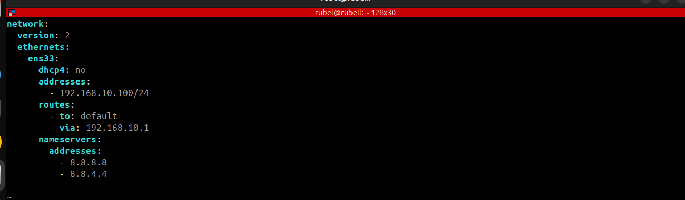
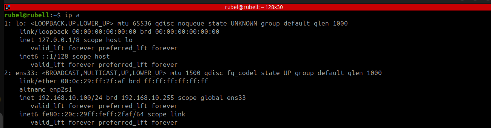
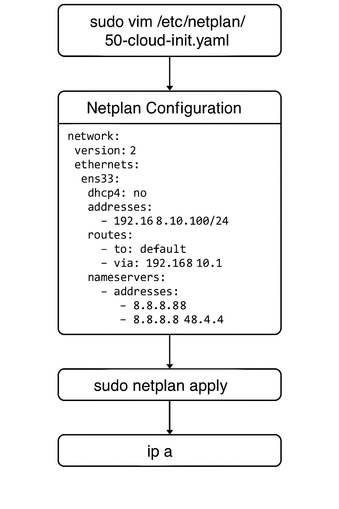

# Network Configuration Setup

This setup configures a static IP address and DNS servers on an Ubuntu server using `netplan`.

## Steps:

1. **Edit Netplan Configuration:**
   Open the netplan configuration file:
```
sudo vim /etc/netplan/50-cloud-init.yaml
```
</br>
   
2. **Configuration Example:**


 
   Rplace the file contents with the following configuration:
  ```
    network:
  version: 2
  ethernets:
    ens33:
      dhcp4: no
      addresses:
        - 192.168.10.100/24
      routes:
        - to: default
          via: 192.168.10.1
      nameservers:
        addresses:
          - 8.8.8.8
          - 8.8.4.4
  ```
</br>

3. **Apply Configuration:**



   Apply the netplan configuration:
```
sudo netplan apply
```
</br>

4. **Verify Network Settings:**
    To verify the new IP and network settings, use:
    
```
ip a
```

- **Description:**
  - Static IP: Sets the IP address to `192.168.10.100/24`.

  - Default Gateway: Sets the gateway to `192.168.10.1`.

  - DNS Servers: Uses Google's DNS servers `(8.8.8.8 and 8.8.4.4)`.

  - No DHCP: Disables DHCP and assigns a static IP.
 
    
- **Diagram**

  


 
   
