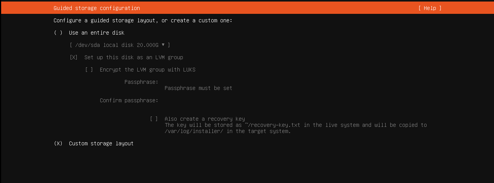
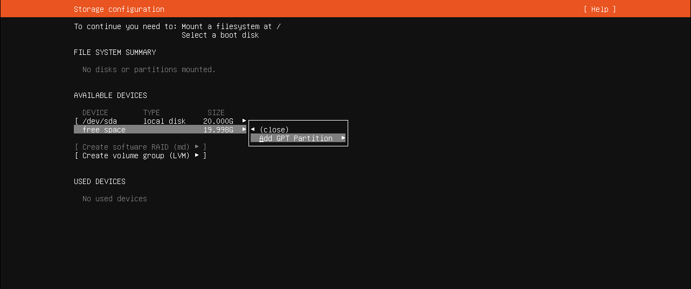
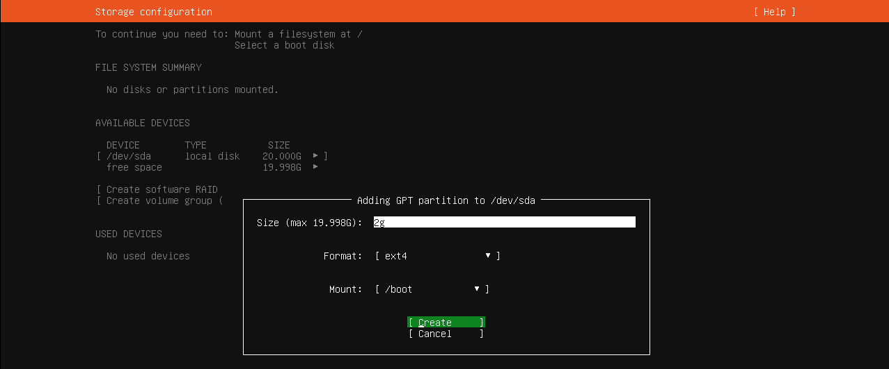
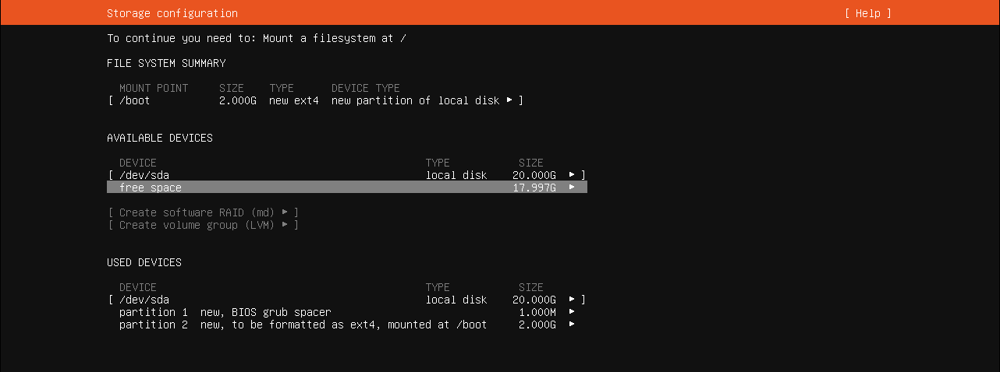
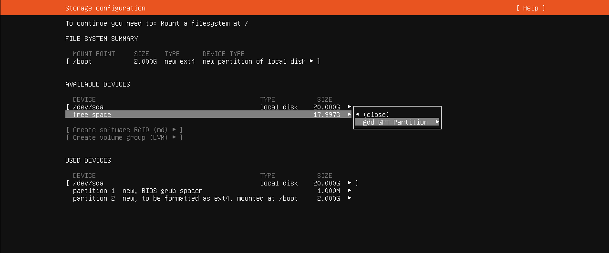
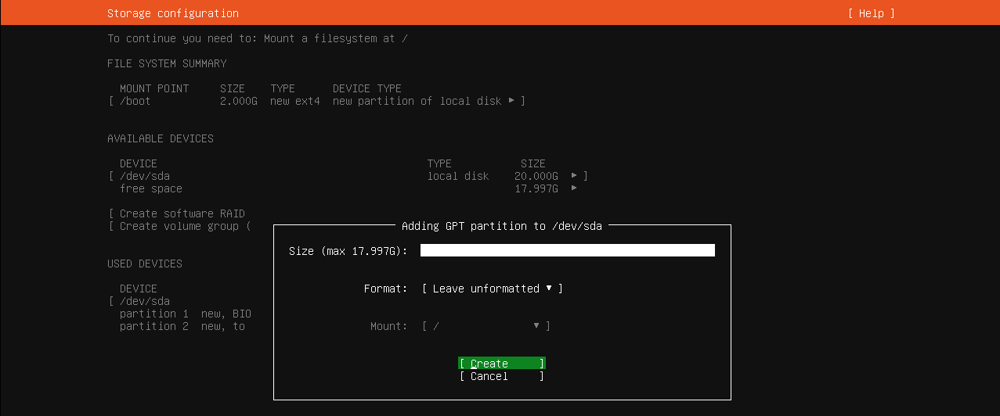
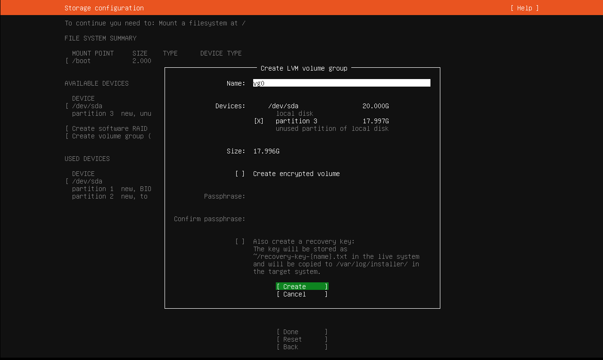
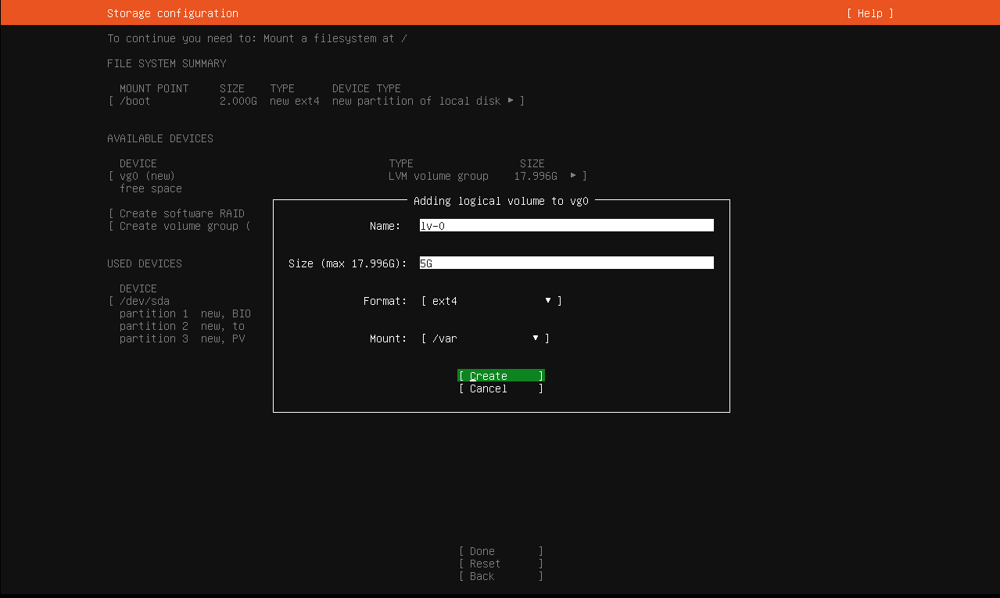
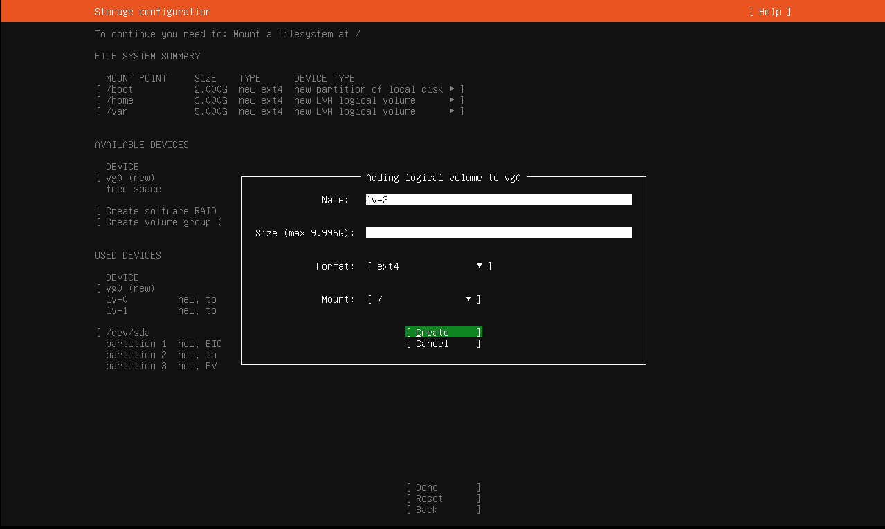
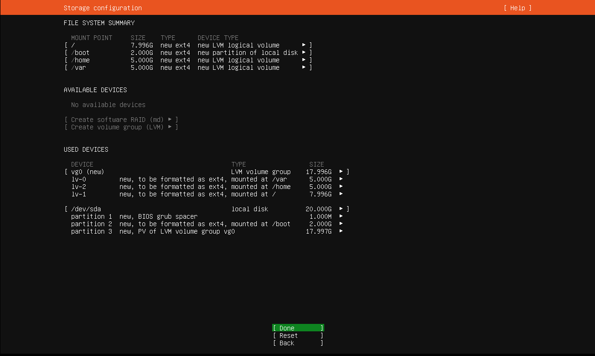

# Ubuntu Server Installation with LVM – Quick Guide

This document provides a brief guide on how to install Ubuntu Server with Logical Volume Management (LVM) support.

## Step 1: Download ISO & Boot
- Download from: [https://ubuntu.com/server](https://ubuntu.com/server)
- Create a bootable USB and boot your system

## Step 2: Language & Keyboard
- Select your preferred language and keyboard layout

## Step 3: Network Configuration
- Use DHCP or configure a Static IP if needed

## Step 4: Disk Setup with LVM
- Choose **"Use an entire disk with LVM"**
- Optionally customize LVM partitioning:
  - `/` (root)
  - `swap`
  - `/home` (optional)

## Step 5: User Setup
- Enter username and password
- Optionally install OpenSSH server

## Step 6: Finish Installation
- Proceed with installation
- Reboot after completion

## Check LVM After Installation:
```bash
sudo vgdisplay     # View Volume Groups
sudo lvdisplay     # View Logical Volumes
df -h              # View disk usage
```

---
**Step - 1** </br>
  ☛ Select Custom Storage Layout



---
**Step - 2** </br>
  ☛ Select Free Spache </br>
            ↪️ Add GPT Partition
            


---
            
**Step - 3**  </br>
  ☛ Select /boot </br>
              ↪️ Create
              


---

**Step - 4**
  ☛ Select Free Spache </br>
            ↪️ Add GPT Partition
            


 ⬇️          


---

**Step - 5**
  ☛ Select Free Spache </br>
            ↪️ Format [leave-unformatted]



---
            
**Step - 6**  </br>
    ☛ Create Encrypted Volume   
    


---

**Step - 7**  </br>
  ☛ Logical Volume Var

 

---

**Step - 8**  </br>
  ☛ Logical Volume Home
  


---

**Step 9**  </br>
  ☛ Then Forward Slash

  

---

** ☛ OutPut**

  

---  


